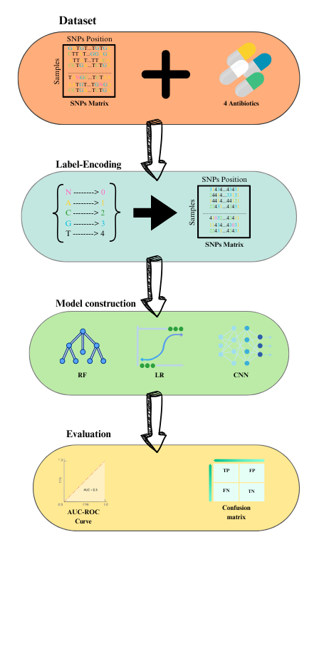

## Prediction of antimicrobial resistance based on whole-genome sequencing and machine learning

Antimicrobial resistance (AMR) is a significant global health threat to both humans and animals. Given the urgency of combating AMR, there is a pressing need for faster and more accurate diagnostic methods. Traditional antimicrobial susceptibility testing (AST), however, is often slow, low throughput, and limited to cultivable bacteria. In contrast, machine learning techniques offer a promising avenue for automating the prediction of AMR using genomic data from bacteria. Yet, there has been limited research on comparing different machine learning approaches for AMR prediction using various encoding methods and whole-genome sequencing (WGS) data without relying on prior knowledge.

In this study, we assessed the performance of logistic regression (LR), support vector machine (SVM), random forest (RF), and convolutional neural network (CNN) for predicting AMR to four antibiotics—ciprofloxacin (CIP), cefotaxime (CTX), ceftazidime (CTZ), and gentamicin (GEN)—using whole-genome sequencing data. We employed both label encoding and FCGR encoding techniques to evaluate the models' effectiveness.

## Data preprocessing

Data curation:
 
This file includes the different way the dataframe has been cleaned, which involves several key preprocessing steps:
Anonymization: Sensitive data is anonymized to ensure privacy and compliance.
Handling Missing Values: Any rows with missing data are removed to ensure clean and complete datasets.
Fixing Minor Errors: Small spelling mistakes and formatting errors are corrected.
After these steps, the two curated files are combined into a single dataset and undergo another round of curation to ensure data consistency and quality.
 
 
Label Encoding:
 
Once the data is curated, we perform label encoding (as detailed in the encoded_coding_file.py). This process converts categorical labels into numerical values, which makes the data easier to process for machine learning algorithms.
 
 
Final Combined Dataset:
 
The final file, named variants&metadata_fixed1.7z, contains the label-encoded and combined dataset. This file is the cleaned and processed version that was used as input for the various machine learning algorithms.
 
 
## Model implementation
Algorithm:
 
The file contains six models: five Random Forest models and one Convolutional Neural Network (CNN) model.
The first Random Forest model includes all drugs and attempts to predict drug resistance simultaneously for all drugs. In contrast, the other four Random Forest models make predictions for each drug individually.
The Convolutional Neural Network model also predicts drug resistance for all drugs simultaneously, similar to the first Random Forest model.
Additionally, the file includes an evaluation metric, which allows users to assess the model's performance immediately after testing. Metrics such as accuracy, recall, and others are provided, along with a confusion matrix to facilitate a clearer understanding of these values.
 
 

